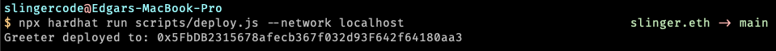

# Basic Sample Hardhat Project

Try running some of the following tasks:

```shell
# 1. Compile the Smart Contract
npx hardhat compile

# opc: Do the test
npx hardhat test

# 2. Create a local EVM
npx hardhat node

# 3. Deploy the contract
npx hardhat run scripts/deploy.js --network localhost
```

We need some of the test addresses in order to interact with the blockchain.
To do this wee need a wallet like [MetaMask](https://metamask.io) and just
import the some address with the secret key that the `npx hardhat node` will show

## Next.js

Create a environment variable called `NEXT_PUBLIC_CONTRACT_ADDRESS` and
paste the address of the deployed contract

ex: `NEXT_PUBLIC_CONTRACT_ADDRESS=0x44sx34...`

Start the local enviroment

`yarn dev`

That's all 🙃 (I think...)

### FAQ

If there's an error related to de _nonce_ being to high, then you can go to the MetaMask
wallet and open the advanced settings of your account and reset it.

---

## Reference

- [The Complete Guide to Full Stack Ethereum Development ](https://dev.to/dabit3/the-complete-guide-to-full-stack-ethereum-development-3j13)
- [Hardhat](https://hardhat.org/getting-started/)
- [Solidity, Blockchain, and Smart Contract Course – Beginner to Expert Python Tutorial](https://www.youtube.com/watch?v=M576WGiDBdQ)

## Screen Shots




